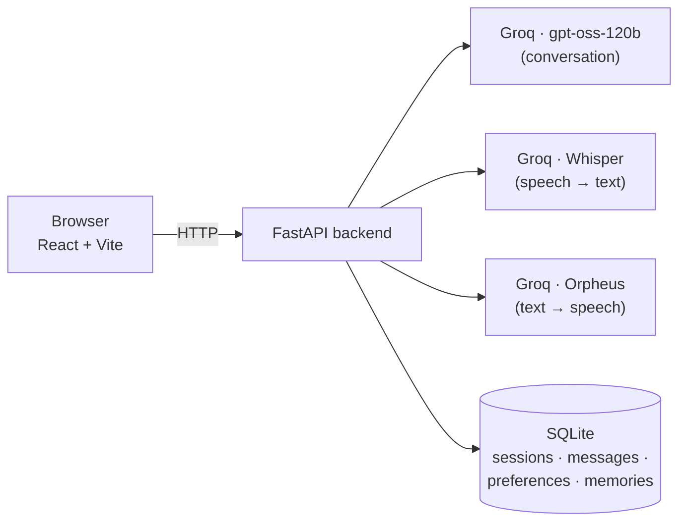

# BUD — Your All-Time Buddy

A private, nonjudgmental AI companion that talks and listens in English , adapts to what you actually need in the moment, and remembers you only with your explicit permission.

**Live demo:** [bud-frontend.onrender.com](https://bud-frontend.onrender.com/)
*(Free-tier hosting: the first request after a period of inactivity can take 30–60 seconds to wake up — that's the host, not a bug.)*

Built for the **AI Build Challenge 2026**.

---

## What is BUD?

Most AI assistants use the same tone for a joke and a crisis. BUD doesn't. It reads what you actually need — to vent, to get practical help, to hear an honest take, to learn something, or just to talk nonsense — and adapts its *strategy* while keeping one consistent, warm personality underneath. It is not a therapist or a crisis service, and it says so.

BUD supports typed and spoken conversation in English and Hinglish (mixed Hindi-English, the way people actually talk), speaks its replies aloud, and — only when you say yes — remembers things about you across conversations.

## Features

- **Five response modes** — `LISTEN`, `HELP`, `REALITY_CHECK`, `LEARN`, `VIBE` — selected per message, never fixed
- **One consistent personality** — warm, curious, capable of humour and user-invited banter, instantly dropped the moment a conversation turns serious
- **Safety-first routing** — urgent/self-harm language is caught by deterministic, local logic *before* any AI call, so it can't fail if a provider is down
- **Voice in, voice out** — real microphone recording with a live waveform, Whisper transcription, and spoken replies — record and it sends itself, no extra "send" step
- **Personalization** — four sliders (warmth, humour, sarcasm, directness) that visibly change how BUD responds
- **Consent-based memory** — BUD can propose remembering something about you, but nothing is saved until you approve it, and you can forget anything, anytime
- **Per-visitor privacy** — no login required; a private token keeps every visitor's data isolated from everyone else's

## Technologies Used

| Layer | Stack |
|---|---|
| **Frontend** | React 19, Vite 6, plain CSS (no UI framework) |
| **Backend** | FastAPI (Python), SQLite, httpx |
| **AI — conversation** | Groq, `openai/gpt-oss-120b` |
| **AI — speech-to-text** | Groq, `whisper-large-v3` |
| **AI — text-to-speech** | Groq, `canopylabs/orpheus-v1-english` (Orpheus) |
| **Testing** | pytest (backend), Node's test runner + Testing Library (frontend) |
| **Deployment** | Render — a Python web service (backend) + a static site (frontend) |

## Architecture



Safety routing (urgent/self-harm detection) runs as plain, deterministic Python *before* the conversation model is ever called.

---

## Getting Started

### Prerequisites

- **Python 3.11+**
- **Node.js 18+**
- A free **Groq API key** — [console.groq.com](https://console.groq.com)

### 1. Clone the repository

```bash
git clone https://github.com/Ru-04/BUD.git
cd BUD
```

### 2. Backend setup

```bash
cd backend
python -m venv .venv

# Windows
.venv\Scripts\activate

# macOS / Linux
source .venv/bin/activate

pip install -r requirements.txt
```

Create a file named **`backend.env`** in the **project root** (next to this README, *not* inside `backend/`) — it's gitignored and will never be committed:

```env
GROQ_API_KEY=your-groq-api-key-here
GROQ_CHAT_MODEL=openai/gpt-oss-120b
GROQ_WHISPER_MODEL=whisper-large-v3
GROQ_TTS_MODEL=canopylabs/orpheus-v1-english
```

> **Note on the TTS model:** `canopylabs/orpheus-v1-english` requires one-time, one-click terms acceptance in the Groq console before it will respond: visit [console.groq.com/playground?model=canopylabs%2Forpheus-v1-english](https://console.groq.com/playground?model=canopylabs%2Forpheus-v1-english) while signed in and accept the terms once. Text chat and voice transcription work immediately without this step.

### 3. Frontend setup

```bash
cd frontend
npm install
```

### 4. Run the project

Run the backend and frontend in two separate terminals.

**Terminal 1 — backend** (from `backend/`, with the virtual environment activated):

```bash
uvicorn app.main:app --host 127.0.0.1 --port 8000
```

**Terminal 2 — frontend** (from `frontend/`):

```bash
npm run dev
```

Then open **http://localhost:5173** in your browser.

### Running the tests

```bash
# Backend — 192 tests
cd backend && python -m pytest -q

# Frontend — 27 tests
cd frontend && npm test
```

---

## Project Structure

```
BUD/
├── backend/            FastAPI app
│   ├── app/            Routes, services (chat, memory, speak, transcribe), db
│   └── tests/          pytest suite
├── frontend/            React app
│   ├── src/             Components, services, styles
│   └── tests/            Test suite (Testing Library)
├── docs/                 Architecture, API contracts, deployment guide, product decisions
├── render.yaml            Render deployment blueprint
└── tasks.md                Full build log — every feature, bug, and decision with evidence
```

## Known Limitations

These are disclosed deliberately, not hidden:

- **BUD's spoken voice is English-only.** Groq's Orpheus TTS has no Hindi variant; a Hindi-native alternative (Sarvam AI) was evaluated and documented as a future option.
- **The live demo's data doesn't survive a server restart.** Render's free tier has no persistent disk; preferences and memories reset when the server restarts or spins down from inactivity. See `docs/deploy.md` for the upgrade path to durable storage.
- **BUD is not a therapist or emergency service.** Urgent or self-harm language is always routed to a fixed, safe response rather than an AI-generated one.

## Documentation

For deeper reading, see the `docs/` folder:

- [`docs/architecture.md`](docs/architecture.md) — system design
- [`docs/api-contracts.md`](docs/api-contracts.md) — exact API request/response contracts
- [`docs/scope.md`](docs/scope.md) — product decisions and the reasoning behind them
- [`docs/deploy.md`](docs/deploy.md) — full deployment guide
- [`tasks.md`](tasks.md) — the complete build log, with evidence for every feature and bug fix
