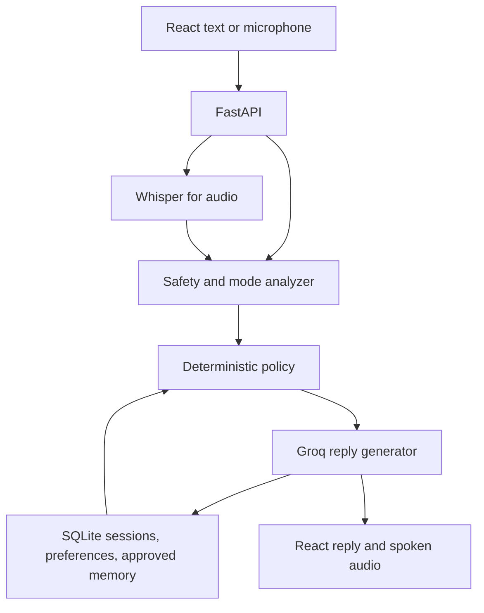

# Architecture

Safety checks run before mode policy; urgent/sensitive routing overrides sliders. The analyzer returns structured fields, never a user-facing reply. Validate its JSON with a strict Pydantic schema and enum; retry at most once and fall back to a cautious `LISTEN`/clarifying reply on invalid output. The policy engine converts mode and effective sliders into bounded instructions. A single response generator sees recent turns and only approved memories. Save both turns atomically after the provider succeeds; failure must not fabricate a reply.

`backend/app/`: `main.py`, `config.py`, `schemas.py`, `db.py`, `identity.py`, `routes/{preferences,memory,transcribe,speak}.py`, `services/{groq,state,safety,policy,chat,memory,transcribe,speak}.py`. `/api/chat` stays in `main.py` (small, already tested; not moved into `routes/` just to match a suggested layout). `frontend/src/`: `App`, `components/{ChatWindow,BudOrb,RecordingPanel,ActionBand,ParametersOverlay,SpaceOverlay,ProfileMenu,Overlay,MemoryPrompt,PersonalityPanel}`, `services/{api,identity}`, styles. The full-page voice-first layout (Gate 4, user-directed) replaced the permanent sidebar: `BudOrb` is the central animated voice representation (idle/recording/responding, respecting reduced-motion, with an entrance zoom-out animation on the hero heading); `RecordingPanel` is the real recording experience (real `AnalyserNode` waveform, pause/resume, timer); `PersonalityPanel`/`MemoryList` and the old sidebar's status content now live in on-demand overlays instead of permanent screen space. This is a functional-and-thematically-consistent pass, not yet Dribbble-level pixel polish -- that remains Gate 5. `ChatWindow` auto-speaks each reply (mutable via a header toggle) using `/api/speak`; Piper is no longer the active TTS choice (see Gate 4 notes below) but remains documented as a possible future self-hosted alternative. Create only modules required by the current gate.

SQLite tables (implemented, Gate 3): `sessions(id, owner_token_hash, created_at)`, `messages(id, session_id, role, content, mode, created_at)`, `preferences(owner_token_hash, warmth, humour, sarcasm, directness, updated_at)`, `memories(id, owner_token_hash, content, category, approved_at, created_at)`, `memory_candidates(id, owner_token_hash, content, category, created_at, expires_at)`. `owner_token_hash` is a SHA-256 hash of a client-generated opaque token (see `docs/api-contracts.md`); never a global dummy user. `db.py` opens a fresh SQLite connection per operation (no long-lived pool) — adequate for a single-process local prototype, revisit under real concurrent load. A visitor's own `sessions` row is created lazily on first `/api/chat` use of a given `session_id`; reusing that `session_id` under a different owner is rejected (`SESSION_OWNER_MISMATCH`), which is the concrete two-visitor isolation mechanism. Memory candidates expire (default 24h) and cannot be approved or read once expired. Production token issuance/rotation policy and data retention duration remain the open decisions in scope.

Transcription (implemented, Gate 4): `POST /api/transcribe` validates content-type/size (≤10MB) then streams the upload directly to Groq Whisper (`whisper-large-v3`) in memory over HTTPS — the backend never writes audio to disk, so "guaranteed cleanup" is trivially true (there is nothing to clean up). The returned transcript is placed in the browser's composer for the user to review/correct before it goes through the ordinary `/api/chat` call; no separate voice pipeline, no acoustic-feature measurement (librosa remains a stretch goal, not built). Optional future acoustic measurements would consume the same in-memory audio and may affect phrasing cautiously; they cannot label the user's mental state.

Speech output (implemented, Gate 4, superseding the Piper stretch-goal decision by explicit user direction after confirming the choice): `POST /api/speak` calls Groq's hosted `canopylabs/orpheus-v1-english` model, chunking text to its documented 200-character-per-call limit and stitching the resulting WAV clips into one file server-side. Requires one-time terms acceptance in the Groq console (manual, account-owner-only) before it will serve requests. Self-hosted Piper remains a documented fallback option if a fully offline/no-per-request-cost voice is wanted later, but is not the active implementation.
